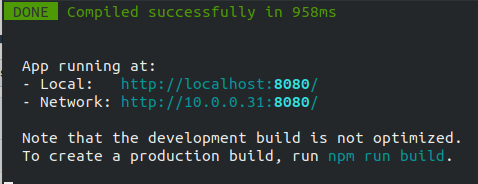

# Apprendre Sass

## Installer NPM
### Sous windows
https://blog.teamtreehouse.com/install-node-js-npm-windows

### Sous mac OS
https://www.dyclassroom.com/howto-mac/how-to-install-nodejs-and-npm-on-mac-using-homebrew

## Récupérez le code sur votre machine
 * Récupérez le projet en local chez vous
```bash
git clone git@github.com:elegna/learn-sass.git
cd learn-sass
npm install
```

__il suffit de faire ceci la première fois, il n'y a pas besoin de le refaire les fois suivantes__

## Lancement du serveur de dév
```bash
npm run serve
```
Cela va lancer un serveur de développement sur votre machine. Vous devriez voir quelque chose de similaire



Vous pouvez maintenant lancer l'url `http://localhost:8080` (ou similaire) et votre page va s'afficher.

## Modifier le code
Une fois que le serveur est lancé, vous pouvez modifier le contenu du fichier public/index.html
ou src/assets/app.scss et la page se rechargera toute seule. 

Si cela ne marche pas rafraîchissez la page dans le navigateur ou relancez entièrement le serveur.
